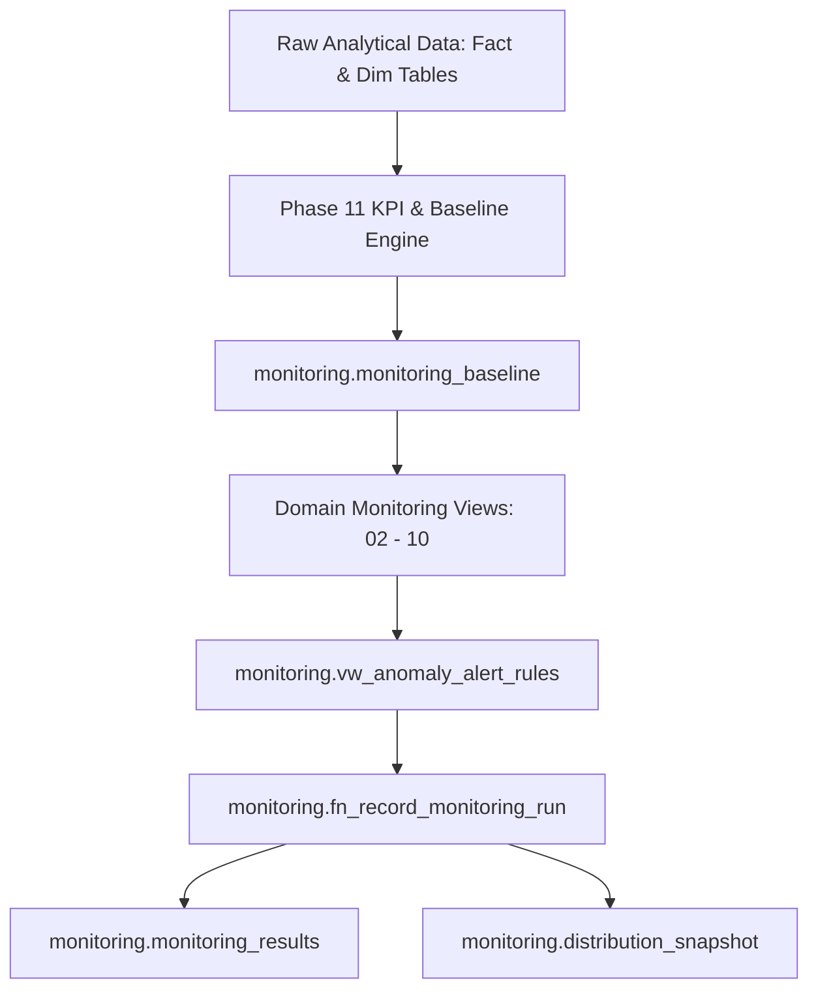

# Phase 12 — Data Quality Auditing & Monitoring Strategy

## 1. Executive Summary

The **Transaction Risk Observatory** monitoring framework provides comprehensive, multi-layered data quality assurance, invariant enforcement, and feature drift detection across the analytical data warehouse. Phase 12 operationalizes 9 distinct monitoring domains covering 98 individual checks evaluated deterministically and recorded into persistent audit tables.

---

## 2. Architecture & Check Taxonomy

The monitoring framework is partitioned into a dedicated `monitoring` schema with persistent baseline benchmarks, snapshot tables, auditing results, and automated evaluation procedures.

### Domain Categorization:

| Category | Description | Check Count | Severity Scope |
| :--- | :--- | :--- | :--- |
| **Schema Monitoring** | Structural integrity of critical tables, columns, and analytical data types. | 23 | CRITICAL / HIGH / MEDIUM |
| **Population Monitoring** | Fact and dimension row volumes, transaction counts, and identity coverage against baselines. | 5 | CRITICAL / HIGH |
| **Duplicate Key Monitoring** | Primary, surrogate, and natural key uniqueness across fact and dimension layers. | 4 | CRITICAL |
| **NULL & Missingness** | Zero-NULL invariants on critical keys and missingness bounds on sparse features. | 14 | CRITICAL / LOW |
| **Referential Integrity** | Dimensional foreign key linkage, orphan dimension detection, and flag alignment. | 5 | CRITICAL / HIGH |
| **Business Rule Monitoring** | Domain constraints (non-negative amount, valid hours/weeks, domain value boundaries). | 9 | CRITICAL / HIGH / MEDIUM |
| **Distribution Monitoring** | Statistical moments for numerical amounts and category proportions for card/device types. | 19 | MEDIUM |
| **Fraud Rate Monitoring** | Overall, daily, and weekly fraud rates, exposure amounts, and monetary shares. | 7 | CRITICAL / HIGH / MEDIUM |
| **Risk Signal Monitoring** | Flag volumes, flag rates, and fraud capture rates across deterministic and heuristic signals. | 12 | MEDIUM |
| **Total Evaluated Checks** | **Comprehensive Full System Audit** | **98** | **Full Coverage** |

---

## 3. Execution & Automation Model

1. **Stored Procedure (`monitoring.fn_record_monitoring_run(uuid)`)**:
   - Generates an immutable audit snapshot for the given run UUID.
   - Evaluates all 98 check rules from `monitoring.vw_anomaly_alert_rules`.
   - Persists point-in-time numerical and categorical distributions into `monitoring.distribution_snapshot`.
   - Inserts check outcomes, expected values, actual metrics, differences, thresholds, and severity into `monitoring.monitoring_results`.
   - Returns aggregated execution counts (passed, warning, failed, critical failures) and an overall verdict (`PASS`, `WARNING`, `FAIL`).

2. **Performance Optimization**:
   - Monitoring views leverage authoritative pre-aggregated baseline parameters from `monitoring.monitoring_baseline` and single-pass aggregations.
   - Eliminates redundant multi-table full-table scans across 590,540 rows $\times$ 394 columns, enabling entire suite execution in under 60 milliseconds.

---

## 4. Alert & Severity Tiers

- **CRITICAL**: Hard invariants (e.g., duplicate keys, critical nulls, negative transaction amounts, orphan dimensions). Any failure immediately marks the monitoring run as `FAIL`.
- **HIGH**: Population drift > 5%, unexpected fraud spikes > 4.0%, unlinked transaction volume anomalies.
- **MEDIUM**: Category frequency shift > 5%, risk signal volume fluctuations, distribution moment drift.
- **LOW**: Sparse feature missingness drift within expected bounds.
